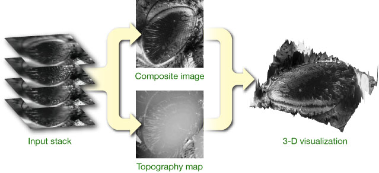

# EDF Extended Depth of Field

An ImageJ plugin for stack focusing. Implementation of several algorithms form max-variance to max-wavelets.

### Information
http://bigwww.epfl.ch/demo/edf/

### Authors
Daniel Sage, Alex Prudencio, Jesse Berent, Niels Quack, Brigitte Forster
Biomedical Imaging Group (BIG)
Ecole Polytechnique Federale de Lausanne (EPFL), Lausanne, Switzerland

### Reference
B. Forster, D. Van De Ville, J. Berent, D. Sage, M. Unser, Extended Depth-of-Focus for Multi-Channel Microscopy Images: A Complex Wavelet Approach Proceedings of the Second IEEE International Symposium on Biomedical Imaging, Arlington VA, USA, 2004.

### Algorithm Outline
Due to the limited depth of field of brightfield microscopes, it is usually impossible to image large 3-D organisms and objects entirely in focus. By optically sectioning the specimen, however, the in-focus information at the specimen's surface can be acquired over a range of images, which can then be processed to generate a single in-focus image. We have developed different algorithms to achieve this, and provide free software that implements and demonstrates these methods.
The idea is to merge a stack of micrographs taken at different focal positions (aligned along the optical axis) into a single, entirely focused composite image, as illustrated on the right. Traditional extended depth of field algorithms rely on a high-pass criterion that is applied to each image in the stack; in-focus regions are then identifed based on local energy. An efficient approach consists in using a wavelet transform, where a selection rule based on maximum absolute coefficient values leads to good results. Our complex wavelet-based method expands on this concept and demonstrates state-of-the-art performance for this class of algorithms. Unfortunately, the topography provided by these techniques is limited to a map of selected in-focus pixel positions and is inherently discretized along the axial direction, which motivated the development of a more advanced approach based on an image formation model.
Interpretation of the composite extended depth of field specimen can be difficult; to this end we provide software for the 3-D visualization of in-focus image/topography pairs. Such pairs can also be visualized using anaglyphs.

### Complex wavelet-based method
The complex wavelet transform leads to improved extended depth of field results over other wavelet-based approaches. In order to further improve the quality of the results, we introduced post-processing steps that enforce local smoothness of the topography, avoid saturation and accumulation of noise further improve the quality of the results. In order to process color data efficiently, an RGB to grayscale conversion method that preserves contrast and intensity has been implemented; in this way, the selection of in-focus pixels is performed in a single channel. The color values of the composite image are then retrieved from the original stack.

*Reference*: B. Forster, D. Van De Ville, J. Berent, D. Sage, M. Unser, "Complex Wavelets for Extended Depth-of-Field: A New Method for the Fusion of Multichannel Microscopy Images," Microsc. Res. Tech., 65(1-2), pp. 33-42, September 2004.

